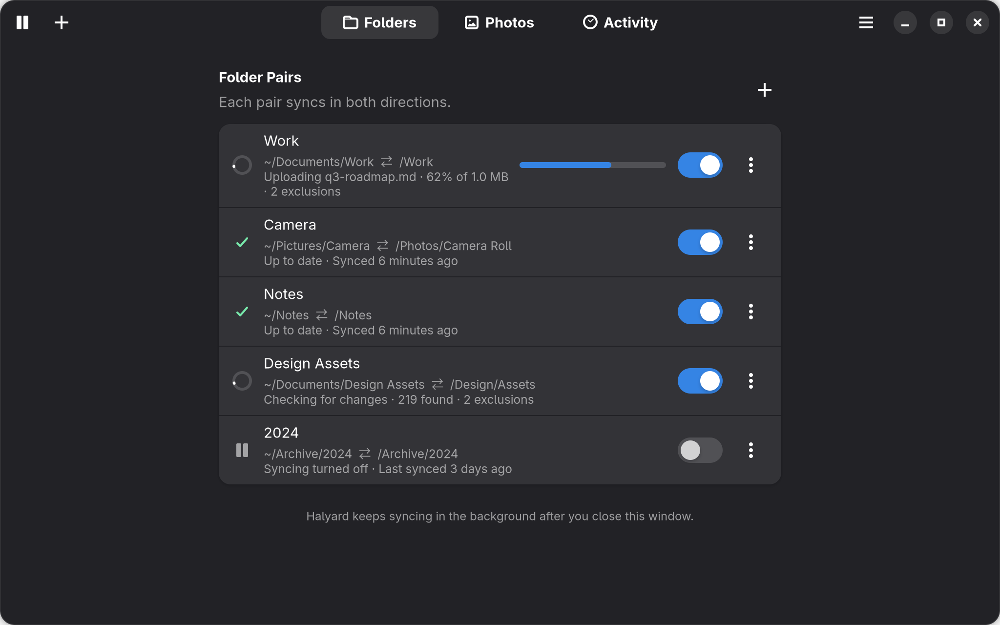

# Halyard

Two-way folder sync for Proton Drive on GNOME.

Sync local folders with Proton Drive, browse your photo library, and manage
transfers from a native GTK4 and libadwaita app.

> **This is a third-party application not officially supported by Proton.**
> It is not affiliated with, endorsed by, or produced by Proton AG. It is built
> on Proton's open-source Drive SDK, but Proton provides no support for it.



## Features

- **Two-way sync:** pair local and Proton Drive folders to sync additions,
  edits and deletions. Add multiple pairs and exclude files or folders by pattern.
- **Conflict handling:** keeps both versions when a file is edited on both
  sides, and preserves edits when the other side deletes a file.
- **Efficient moves:** detects renames and moves without re-transferring files.
- **Photos:** browse galleries and albums, preview photos, play videos,
  download originals, and upload JPEG, PNG or WebP images.
- **Background sync:** keeps running when the window is closed, with transfer
  history in Activity and an optional tray icon.
- **Browser sign-in:** Halyard never sees your password. Sessions are stored
  in your keyring and the local metadata cache is encrypted.

## Installation

Download a package from [Releases](https://github.com/VottonDev/halyard/releases)
and run the matching command in the download directory:

```bash
# Debian/Ubuntu
sudo apt install ./halyard_*_all.deb

# Arch Linux
sudo pacman -U ./halyard-bin-*-any.pkg.tar.zst
```

Open Halyard from the application menu. Packages install runtime dependencies;
Bun and an SDK build are only needed when building from source.

### Requirements

- GNOME on Wayland or X11, with a Secret Service provider such as `gnome-keyring`
- Node 22.13+
- Python 3 with PyGObject, GTK 4.10+ and libadwaita 1.6+

Ubuntu 26.04 and current Arch provide the required runtime versions. Debian 13
needs a Node 22.13+ apt repository enabled first. Ubuntu 24.04's standard
repositories do not provide the required libadwaita version. See the
[packaging guide](packaging/README.md) for details.

### From source

Source builds require Node 22.15+ and Bun. Bun applies a required crypto package
patch; npm is not supported.

```bash
git clone --recurse-submodules https://github.com/VottonDev/halyard
cd halyard
./packaging/install.sh
systemctl --user enable --now halyard-daemon.service
halyard
```

The installer builds the pinned Proton SDK and daemon, then installs Halyard
for your user without administrator access.

## Usage

1. Open Halyard and sign in through your browser.
2. Select **+** to pair a local folder with a folder in Proton Drive.
3. Sync starts automatically. Check **Activity** for transfers and select
   **Conflicts** from the app menu to review conflicting changes.

Halyard only syncs paired folders. Deletions sync too: if the other copy is
unchanged, it is deleted, with the remote copy recoverable from Proton's Trash.
If the other copy has been edited, Halyard keeps the edit. Open **Trash** from
the app menu and select **Restore** to recover deleted items.

Closing the window leaves sync running. To stop it, select **Stop service** in
Preferences or run `systemctl --user stop halyard-daemon`.

See the [user guide](docs/user-guide.md) for exclusion patterns, conflict
resolution, troubleshooting and uninstall instructions.

## Limitations

- Linux and GNOME only; one account at a time
- No resumable transfers; interrupted uploads restart
- Symlinks are skipped
- Shared-with-me sync requires editing access

## Development

The Node daemon in `daemon/` handles Proton Drive access and sync. The Python
GTK UI in `ui/` communicates with it through the [D-Bus API](docs/dbus-api.md).

From a checkout with the source-build requirements installed:

```bash
git submodule update --init
./scripts/build-proton-sdk.sh
cd daemon
bun install
bun run test
node scripts/build.mjs
./node_modules/.bin/tsc --noEmit
```

The daemon runs from `dist/`, so rebuild it after changing `daemon/src/`.
For UI work, run `./run-dev.sh` from `ui/` to start the app with a mock daemon.

Read [AGENTS.md](AGENTS.md) for build constraints and sync invariants. Live test
scripts (`daemon/scripts/live-test*.mjs`) write to the connected Proton Drive
account and require the account owner's permission before running.

## Licence

Halyard is licensed under the [MIT License](LICENSE). It bundles Proton Drive
SDK code under its own MIT licence; see the
[third-party notices](THIRD_PARTY_NOTICES.md). Use of Proton's hosted services
remains subject to Proton's terms.
